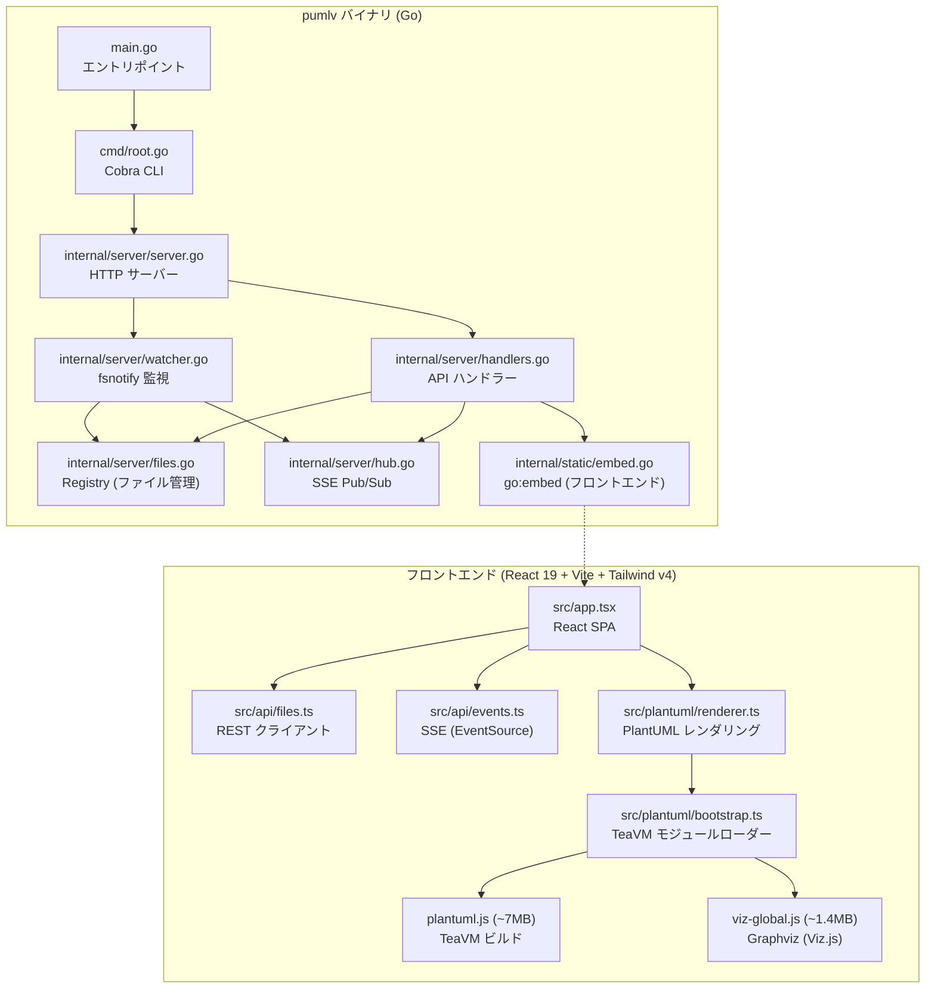
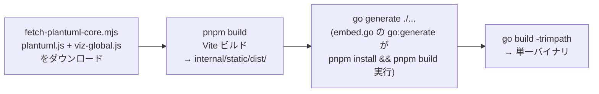
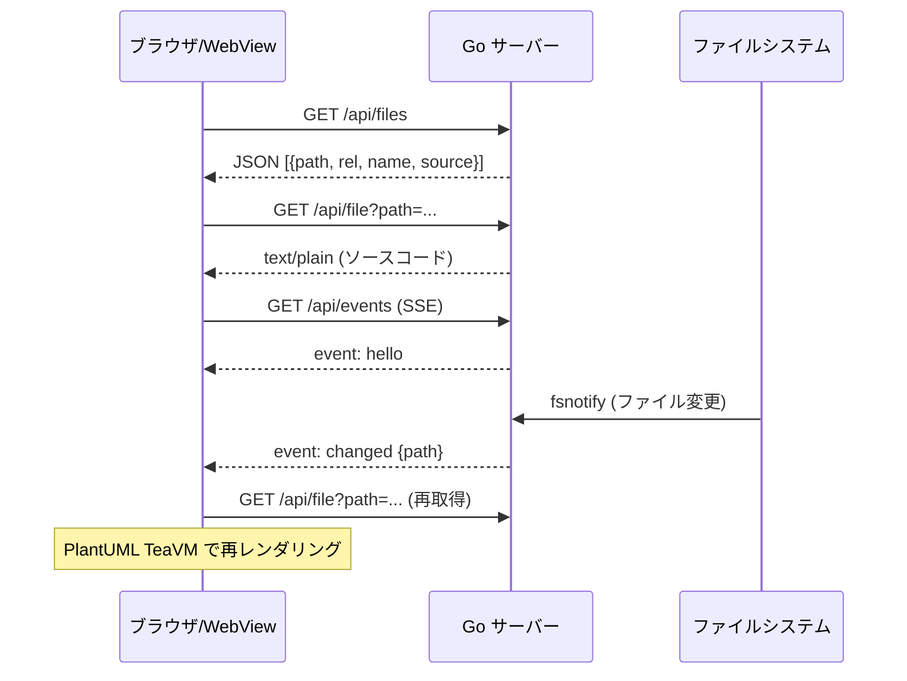
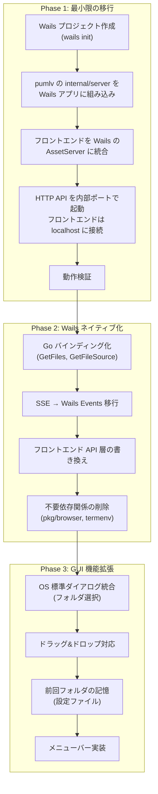

# Step.1 — pumlv リポジトリ解析レポート

## 1. 概要

[pumlv](https://github.com/rin2yh/pumlv) は、PlantUML ファイルのローカルプレビューサーバーである。`pumlv <path>` を実行するとブラウザでダイアグラムが表示され、ファイル保存時に自動で再レンダリングされる。Java・Docker・外部サーバーは不要。

- **最新バージョン**: v0.3.6
- **Go モジュール**: `github.com/rin2yh/pumlv`
- **ライセンス**: MIT

---

## 2. アーキテクチャ分析

### 2.1 全体構成図



### 2.2 バックエンド (Go) の構成

| ファイル | 役割 |
|---|---|
| `main.go` | エントリポイント。`CREDITS` を `go:embed` で埋め込み、`cmd.Execute()` を呼ぶ |
| `cmd/root.go` | Cobra によるCLI定義。`--port`, `--host`, `--no-open`, `--ext` フラグ |
| `internal/server/server.go` | `Server` 構造体の定義。`New()` で初期化、`Start()` で `net.Listen` → HTTP 起動 |
| `internal/server/handlers.go` | `GET /api/files`, `GET /api/file`, `GET /api/events` (SSE), SPA配信 |
| `internal/server/files.go` | `Registry` — ファイル列挙、ホワイトリスト、拡張子フィルタリング |
| `internal/server/watcher.go` | `fsnotify` によるファイル監視、100ms デバウンス、Hub への broadcast |
| `internal/server/hub.go` | SSE Pub/Sub ハブ。チャネルベースのファンアウト |
| `internal/static/embed.go` | `//go:embed all:dist` でフロントエンドビルド成果物を埋め込む |
| `version/version.go` | `Name`, `Version`, `Revision` 変数（GoReleaser が ldflags で上書き） |

### 2.3 フロントエンド (React) の構成

| パス | 役割 |
|---|---|
| `src/main.tsx` | React エントリポイント |
| `src/app.tsx` | メインレイアウト（サイドバー + プレビュー + ソースビュー） |
| `src/api/files.ts` | `fetchFiles()`, `fetchFileSource()` — REST API クライアント |
| `src/api/events.ts` | `subscribe()` — `EventSource` による SSE 受信 |
| `src/plantuml/bootstrap.ts` | `plantuml.js` + `viz-global.js` の動的ロード |
| `src/plantuml/renderer.ts` | `renderPlantUML()` — TeaVM モジュールを呼び出して SVG 生成 |
| `src/hooks/use-file-list.ts` | ファイル一覧取得・選択管理 |
| `src/hooks/use-active-render.ts` | 選択ファイルの取得→レンダリング |
| `src/hooks/use-server-events.ts` | SSE イベントの受信とディスパッチ |
| `src/components/file-tree/` | ファイルツリー（ディレクトリ折りたたみ付き） |
| `src/components/preview/` | SVG プレビュー（ズーム・パン・ミニマップ） |
| `src/components/source-view/` | ソースコード表示（Shiki ハイライト・折りたたみ） |

### 2.4 依存関係

#### Go 依存関係（直接）

| パッケージ | 用途 |
|---|---|
| `github.com/fsnotify/fsnotify` | ファイルシステム監視 |
| `github.com/k1LoW/donegroup` | Context ベースのグレースフルシャットダウン |
| `github.com/muesli/termenv` | ターミナル出力の装飾 |
| `github.com/pkg/browser` | デフォルトブラウザの起動 |
| `github.com/spf13/cobra` | CLI フレームワーク |

#### フロントエンド依存関係（主要）

| パッケージ | 用途 |
|---|---|
| `react` / `react-dom` (v19) | UI フレームワーク |
| `react-zoom-pan-pinch` | ズーム・パン機能 |
| `shiki` | シンタックスハイライト |
| `tailwindcss` (v4) | CSS フレームワーク |
| `vite` (v8) | ビルドツール |
| `plantuml.js` + `viz-global.js` | ブラウザ内 PlantUML レンダリング（外部ダウンロード） |

### 2.5 ビルドパイプライン



### 2.6 通信フロー



---

## 3. Wails2 ポーティング — リスク抽出と対策

### 3.1 リスク一覧

| # | リスク | 影響度 | 発生確率 | 詳細 |
|---|---|---|---|---|
| R1 | HTTP サーバー ↔ WebView の通信アーキテクチャ変更 | **高** | 確実 | pumlv は `net/http` サーバーとブラウザを分離して動作。Wails は `AssetServer` + Go バインディングという異なるモデル |
| R2 | SSE (`EventSource`) の Wails 上での動作 | **高** | 中 | WebView2 は SSE をサポートするが、Wails の `AssetServer` 経由だとストリーミングに制約がある可能性 |
| R3 | PlantUML TeaVM バンドル（~8.4MB）の配信 | **中** | 中 | `plantuml.js` (~7MB) + `viz-global.js` (~1.4MB) の大きなファイルを `go:embed` + Wails AssetServer 経由で配信する際のパフォーマンス |
| R4 | `donegroup` によるライフサイクル管理の競合 | **中** | 低 | Wails も独自のライフサイクル (`OnStartup`, `OnShutdown`) を持つ。二重管理の複雑さ |
| R5 | `cobra` CLI の共存 | **中** | 低 | Wails アプリとしての起動と CLI フラグ (`--port` 等) の共存が必要 |
| R6 | `pkg/browser` の不要化 | **低** | 確実 | Wails アプリではブラウザ起動は不要（WebView が UI） |
| R7 | `termenv` ターミナル出力の不要化 | **低** | 確実 | GUI アプリではターミナル出力の装飾は不要 |
| R8 | Go バージョン要件 (go 1.26.2) | **中** | 低 | Wails v2 が要求する Go バージョンとの互換性確認が必要 |
| R9 | フロントエンド ビルドチェーンの統合 | **中** | 中 | pumlv は `pnpm` + `Vite` + `Tailwind v4`。Wails のテンプレートは `npm` ベースが多い |
| R10 | `fetch-plantuml-core.mjs` の実行タイミング | **中** | 低 | ビルド時に外部からファイルをダウンロードするスクリプト。Wails ビルドチェーンとの統合が必要 |

### 3.2 対策策定

#### R1: HTTP サーバー ↔ WebView の通信アーキテクチャ変更（高リスク）

**課題**: pumlv はバックエンド (Go HTTP) ↔ フロントエンド (ブラウザ) が REST API + SSE で通信する。Wails では Go メソッドを直接バインドする方式が推奨される。

**対策 — 2段階アプローチ**:

1. **Phase 1: HTTP サーバーをそのまま内蔵** (低リスク移行)
   - pumlv の `internal/server` をほぼそのまま活用
   - Wails の `AssetServer` でフロントエンドを配信しつつ、バックグラウンドで `internal/server` の HTTP API も起動
   - フロントエンドの API 呼び出し先を `localhost:<port>` に固定
   - **利点**: 最小限の変更で動作確認可能
   - **欠点**: 内部的に HTTP サーバーを2つ動かす冗長さ

2. **Phase 2: Wails バインディングへの移行** (最終形)
   - `handleFiles` → Go のバウンドメソッド `App.GetFiles()`
   - `handleFile` → Go のバウンドメソッド `App.GetFileSource(path)`
   - SSE → Wails の `EventsEmit` / `EventsOn` に置き換え
   - **利点**: Wails ネイティブな通信、SSE の信頼性問題を回避
   - **欠点**: フロントエンドの API 層を全面書き換え

**推奨**: Phase 1 で動作確認後、Phase 2 へ段階的に移行

#### R2: SSE の Wails 上での動作（高リスク）

**課題**: `EventSource` は WebView2 (Chromium) で技術的にはサポートされるが、Wails の `AssetServer` 経由でのストリーミングに問題が出る可能性がある。

**対策**:
- **Phase 1 で検証**: 内蔵 HTTP サーバーへの直接 SSE 接続で動作確認
- **最終的には Wails Events に移行**: `runtime.EventsEmit(ctx, "file-changed", path)` をバックエンドから呼び出し、フロントエンドで `runtime.EventsOn("file-changed", callback)` で受信
- これにより SSE を完全に排除し、Wails ネイティブな双方向通信に置き換え

#### R3: PlantUML TeaVM バンドルの配信（中リスク）

**課題**: `plantuml.js` + `viz-global.js` は合計約 8.4MB あり、Wails の `AssetServer` 経由で配信する際にメモリ使用量や初回ロード時間に影響する可能性。

**対策**:
- Wails の `//go:embed` を使って、pumlv と同様にフロントエンド成果物にバンドル
- `AssetServer.Assets` にセットすれば、ファイルサーバーとして機能する
- 必要に応じて `AssetServer.Handler` でカスタムハンドリング（キャッシュヘッダー等）
- バイナリサイズは増えるが、pumlv 本来の設計思想（単一バイナリ）と一致

#### R4: ライフサイクル管理の統合（中リスク）

**課題**: pumlv は `donegroup` + `signal.NotifyContext` でグレースフルシャットダウンを管理。Wails は `OnStartup` / `OnShutdown` フックを持つ。

**対策**:
- Wails の `OnStartup` で `server.New()` + `watcher.Start()` を呼ぶ
- Wails の `OnShutdown` で `watcher.Close()` + `hub.Close()` を呼ぶ
- `donegroup` は不要になる可能性がある（Wails がプロセスライフサイクルを管理）
- ただし段階的移行のため、Phase 1 では `donegroup` を残す

#### R5: CLI の共存（中リスク）

**課題**: Wails アプリとして起動しつつも、CLI 引数（特にパス指定）を受け付けたい。

**対策**:
- `cobra` を残しつつ、`rootCmd.RunE` の中身を Wails の `wails.Run()` に置き換え
- `os.Args` を解析してパス引数を取得し、`wails.Run()` の `OnStartup` でサーバーを初期化
- Wails アプリでは `--port`, `--host` は不要になるため、フラグを整理

#### R6, R7: 不要ライブラリの除去（低リスク）

**対策**:
- `pkg/browser`: GUI ではブラウザ起動が不要。条件分岐で無効化するか、import を削除
- `termenv`: GUI ではターミナル出力が不要。ログ出力は `slog` やファイルログに切り替え
- ただし、CLI モードも並行維持する場合は条件分岐で対応

#### R8: Go バージョン互換性（中リスク）

**対策**:
- pumlv は `go 1.26.2` を要求。Wails v2 の最新版が対応しているか確認
- `wails doctor` コマンドで環境検証
- 必要に応じて go.mod の `go` ディレクティブを調整

#### R9: フロントエンド ビルドチェーンの統合（中リスク）

**課題**: pumlv のフロントエンドは `pnpm` + `Vite` + `React 19` + `Tailwind v4` という比較的モダンなスタック。Wails テンプレートとは異なる。

**対策**:
- Wails は `wails.json` の `frontend:install` と `frontend:build` でカスタムコマンドを指定可能
  ```json
  {
    "frontend:install": "pnpm install",
    "frontend:build": "pnpm run build"
  }
  ```
- Vite の出力先を Wails の `embed` パスに合わせる
- `wails dev` と `vite dev` の同時利用は、Wails のフロントエンド devURL 設定で対応

#### R10: PlantUML ダウンロードスクリプト（中リスク）

**課題**: `fetch-plantuml-core.mjs` がビルド時に `plantuml.js` + `viz-global.js` を GitHub Releases からダウンロードする。

**対策**:
- ビルドスクリプトは `pnpm run build` の一部として実行されるため、Wails ビルドでも自動実行される
- オフライン環境では事前ダウンロードが必要
- CI/CD ではキャッシュ戦略を検討

---

## 4. ポーティング工程の全体像



---

## 5. 特記事項

### 5.1 アーキテクチャ上の優位点
- pumlv のバックエンド（ファイル監視、ファイル列挙）は `internal/server` パッケージに綺麗に分離されており、Wails への移植が容易
- フロントエンドは React SPA として自己完結しており、API 層のみ差し替えれば Wails WebView 上でそのまま動作可能
- PlantUML レンダリングはブラウザ内完結（TeaVM）なので、バックエンド依存がない

### 5.2 注意が必要な点
- `go:embed` の `//go:generate` ディレクティブ（`internal/static/embed.go`）で `sh -c` を使用しているため、Windows 環境では代替が必要
- `Makefile` は Unix シェル前提のコマンドが含まれる
- `go 1.26.2` という要件は最新のため、Wails v2 との互換性を検証ワークフローで確認する必要がある

### 5.3 ファイルサイズ見積もり
- 現在の pumlv バイナリ: 約 10-15MB（`plantuml.js` + `viz-global.js` を含む）
- Wails 化後: 約 15-20MB（WebView2 ランタイムは OS 側で提供のため含まない）
