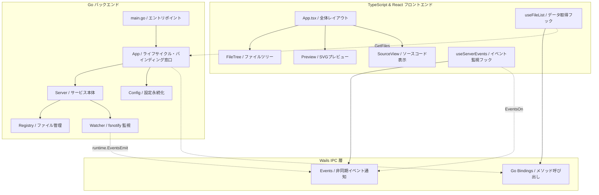
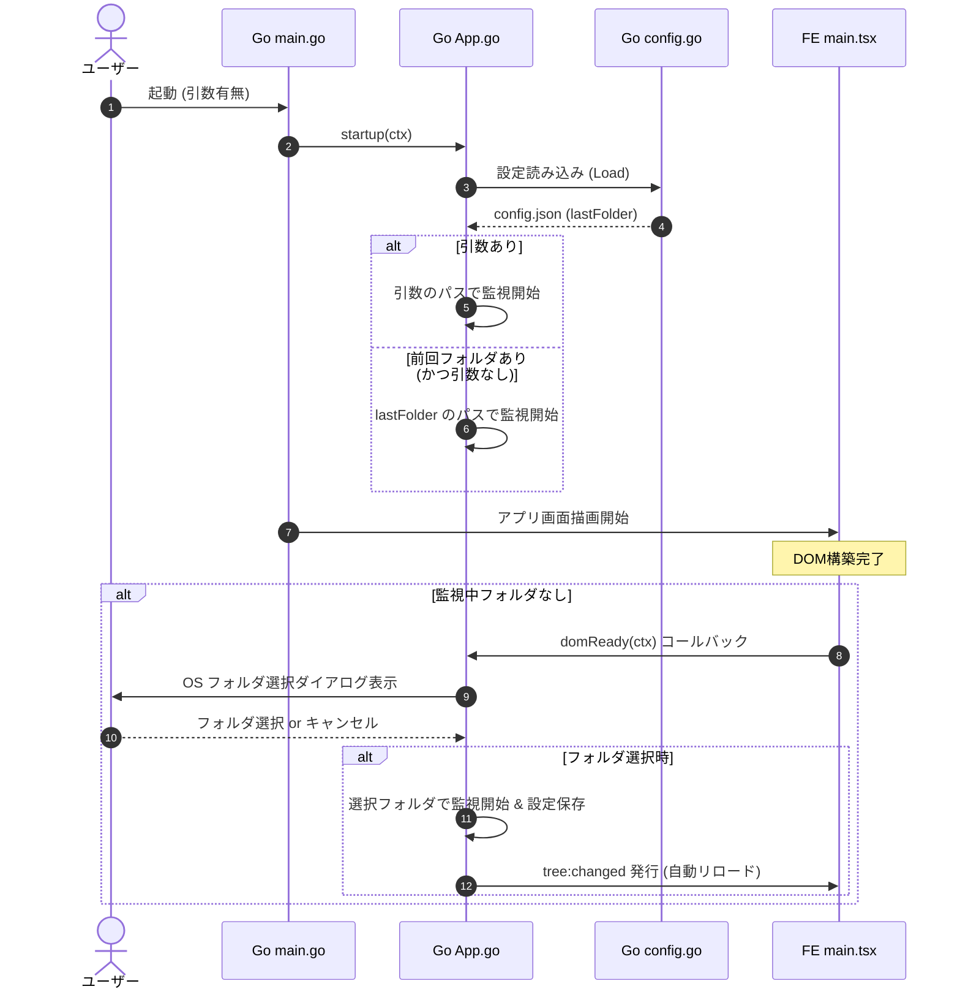
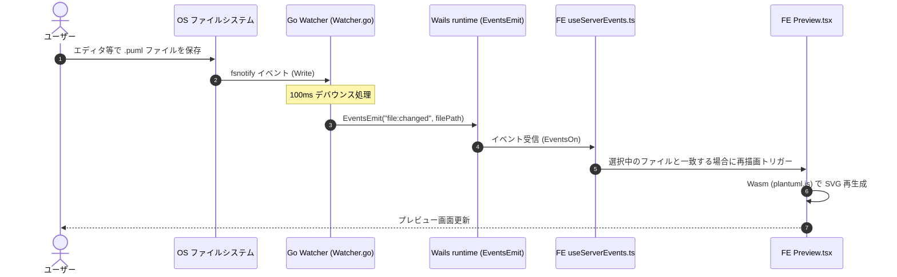

# pumlv-gui 設計書

本ドキュメントは、PlantUML ローカルプレビューツールである `pumlv` を Wails v2 プラットフォームを用いてデスクトップ GUI アプリケーションとして再構築した `pumlv-gui` の内部構造および設計詳細を解説します。

---

## 1. システム概要

`pumlv-gui` は、指定されたローカルフォルダ内の PlantUML ファイル（`.puml`, `.plantuml`, `.iuml`, `.wsd`）を監視し、ファイル変更時に Wails WebView 上のプレビュー画面をリアルタイムに自動更新（ライブリロード）するデスクトップアプリケーションです。

### 主要な特徴
- **完全なネイティブ通信**: 従来のローカル HTTP サーバー（REST + SSE）を完全に排除し、Wails Go バインディングと Wails Events による高速かつセキュアなプロセス間通信に完全移行。
- **マルチプラットフォーム対応**: Wails v2 を採用し、Windows（WebView2）、macOS（WebKit）などでのビルドが可能（Windowsを最優先ターゲットに最適化）。
- **GUI 親和性**: 起動引数だけでなく、OS標準フォルダ選択ダイアログ、前回起動時のフォルダ自動復元、ドラッグ＆ドロップ、メニューバーからのフォルダ変更に対応。

---

## 2. システムアーキテクチャ

`pumlv-gui` は、Go で実装されたバックエンド（コアロジック）と、React + TypeScript で実装されたフロントエンド（UI）が Wails を介して密結合する構成をとっています。

---

## 3. バックエンド設計 (Go)

### 3.1 エントリポイント & ライフサイクル管理 (`main.go`, `app.go`)
- **`main.go`**
  - Wails アプリケーションをブートストラップします。
  - アプリケーションメニューの定義（`menu.NewMenu()`）や、ドラッグ＆ドロップ（DnD）の有効化、ファイルドロップ検知時のコールバック（`runtime.OnFileDrop`）を定義します。
- **`App` 構造体 (`app.go`)**
  - Wails ライフサイクル（`startup`, `domReady`, `shutdown`）を管理します。
  - `os.Args` による起動引数の解析や、`domReady` 時の自動ダイアログオープン制御を行います。
  - フロントエンドに公開される Go メソッド（Wails バインディング）を実装します。
    - `GetFiles()`: 監視中のファイル一覧を取得。
    - `GetFileSource()`: 指定されたファイルのソースコードを取得。
    - `SaveAsPNG(base64Data, defaultName)`: フロントエンドから送信されたBase64エンコード済みのPNGデータをデコードし、OS標準のファイル保存ダイアログ（`runtime.SaveFileDialog`）を開いてローカルファイルに書き出します。

### 3.2 フォルダ監視・ファイルシステム管理 (`internal/server/`)
- **`Server` (`server.go`)**
  - 旧 pumlv の HTTP サーバーから置換されたサービスオブジェクトです。
  - `Registry` と `Watcher` を包含し、ファイル一覧取得（`GetFiles()`）およびファイルソース取得（`GetFileSource()`）の実体を提供します。
- **`Registry` (`files.go`)**
  - 監視対象フォルダ内のサポートファイル一覧を走査・キャッシュします。
  - ディレクトリ走査のフィルタリングや、不正なパスへのアクセスを防ぐセキュリティチェック（`Allowed(path)`）を行います。
- **`Watcher` (`watcher.go`)**
  - `github.com/fsnotify/fsnotify` を使用し、フォルダ内のファイル新規作成・更新・削除を監視します。
  - イベント重複を防止するためのデバウンス制御（100ms）を内蔵しています。
  - 変更検知時、`runtime.EventsEmit` を介してフロントエンドへイベントを発行します。
    - `"tree:changed"`: ファイルの追加・削除・名前変更時に発行。
    - `"file:changed"`: ファイルの更新時にファイルパスを載せて発行。

### 3.3 設定ファイル管理 (`internal/config/`)
- **`Config` (`config.go`)**
  - ユーザーホーム直下の `~/.pumlv-gui/config.json` に設定を JSON 形式で永続化します。
  - 前回開いていたフォルダの絶対パス（`lastFolder`）を保持し、引数なし起動時にこれを自動復元します。

---

## 4. フロントエンド設計 (React + TypeScript)

フロントエンドは SPA (Single Page Application) として構成され、Wails が生成する JS/TS バインディングファイルを介してバックエンドと通信します。

### 4.1 UI 構造 (`frontend/src/`)
- **`App.tsx` (メインコンポーネント)**
  - アプリケーションの基本レイアウトおよび状態管理を行います。
  - **ウェルカム画面 (Welcome State)**:
    - 監視対象フォルダが指定されていない（初回起動、またはダイアログキャンセル時など）に表示されます。
    - ユーザーに「フォルダを選択」ボタンを提示し、ドラッグ＆ドロップを案内する美しくモダンなダークテーマの UI です。
  - **メイン画面 (Workspace State)**:
    - 左側にファイルツリー（`FileTree`）、中央にレンダリングされた図（`Preview`）、右側にソースコード（`SourceView`）を配置した3カラムレイアウトです。
    - **サイドペインの調整・表示トグル**:
      - 左側のファイルツリーペイン（サイドバー）は、右境界をマウスドラッグすることで `180px` 〜 `600px` の間で幅を自由に変更できます。
      - 左右の各ペインは、メインヘッダーの左右両端に配置された対称的なアイコンボタン（左サイドバーアイコン、右サイドバーアイコン）から表示/非表示を切り替えられます。
      - ペインの幅および開閉状態は `localStorage` に保存され、起動時に復元されます。
- **`components/`**
  - `FileTree`: 監視フォルダ内の相対パス構造に基づき、ツリーUIを描画します。
  - `Preview`: PlantUML が生成した SVG テキストを DOM に注入し、拡大・縮小・リセットボタン等のインタラクションを提供します。また右上に `ExportControls` を配置します。
  - `ExportControls`: レンダリングされた図を PNG 画像として「クリップボードにコピー」および「ファイル保存」するためのフローティングアクションボタン UI です。
  - `SourceView`: 選択中ファイルのコードをシンタックスハイライト付きで表示します。

### 4.2 Wails 連携 API 層 (`frontend/src/api/` & `hooks/`)
- **`api/files.ts`**
  - `GetFiles`, `GetFileSource` バインディングメソッドをラップし、コンポーネントから扱いやすい非同期関数として提供します。
- **`api/events.ts`**
  - Wails ランタイムの `EventsOn` を用いて、`"file:changed"` および `"tree:changed"` を監視するサブスクリプション機構を構築します。アンマウント用のクリーンアップ（登録解除）関数を返却します。
- **`hooks/use-server-events.ts`**
  - React の副作用内で `subscribe()` を実行し、ファイル変更イベントを検知して UI の再レンダリングやデータの再フェッチをトリガーします。

### 4.3 PlantUML レンダリング機構 (`frontend/src/plantuml/`)
- Vite 8 の `/public` ディレクトリ制約に対応するため、静的な `import()` ではなく、`fetch()` を使用して `/plantuml/plantuml.js` のテキストデータを取得し、Blob URL を生成して動的にインポートします。
- レンダリング自体はブラウザ（WebView）内の WebAssembly/TeaVM (viz-global.js) で高速に実行されます。

### 4.4 外部連携（PNGエクスポート）設計 (`frontend/src/lib/svg-to-png.ts`)
- **SVG から PNG への変換**:
  - `DOMParser` で SVG の `viewBox` または幅・高さ属性を取得して元サイズを算出し、`Canvas API` を用いてラスタライズを実行します。
  - Word などのドキュメント貼り付け品質（印刷耐性）を考慮し、デフォルトの解像度倍率を `3`（3倍、実質約250〜300dpi相当）に設定しています。
  - 図の見切れ防止および暗い背景の仕様書への対応として、`12px` の白い余白（Padding）を追加し、背景を白色 (`#ffffff`) で塗りつぶして出力します。
  - これらの設定は `svg-to-png.ts` 内の定数（`DEFAULT_SCALE`、`DEFAULT_PADDING`）として定義されており、容易に編集が可能です。
- **クリップボード連携**:
  - `Canvas.toBlob()` を経由して取得した PNG Blob を `ClipboardItem` API に渡し、ブラウザ標準の `navigator.clipboard.write()` 経由でクリップボードにコピーします。これにより、そのまま外部ドキュメント等へ Ctrl+V で貼り付けが可能です。
- **ファイル保存**:
  - 生成した PNG Blob を Base64 文字列に変換し、Wails バインディング `SaveAsPNG` を呼び出します。バックエンド側で OS 標準のファイルダイアログを表示して任意の場所へ書き出します。

---

## 5. 主要データフロー

### 5.1 起動時の自動オープンフロー

### 5.2 ファイル更新時のリアルタイムプレビュー更新フロー

---

## 6. GUI 機能要件との対応マッピング

| ID | 機能要件 | 設計・実装上のアプローチ |
|---|---|---|
| **F1** | 起動引数でのフォルダ指定 | `os.Args[1:]` をパースし、指定された場合は無条件でそのパスを監視対象として初期化。 |
| **F2** | 引数なし起動時の OS ダイアログ指定 | `domReady` 時に監視フォルダがない場合、`runtime.OpenDirectoryDialog` を非同期で自動ポップアップ。ウェルカム画面の「フォルダを選択」ボタンからも手動起動可能。 |
| **F3** | 前回フォルダの記憶 | アプリケーション終了時（`shutdown`）およびフォルダ切替時に `~/.pumlv-gui/config.json` へ絶対パスを記録し、次回起動時に自動ロード。 |
| **F4** | ドラッグ＆ドロップ対応 | Wails の `EnableFileDrop: true` を有効化。`runtime.OnFileDrop` にてドロップされたパスのうち、最初のディレクトリパスを `OpenFolder` する。 |
| **F5** | メニューバー対応 | Go 側で `menu.NewMenu()` を用いて「ファイル」メニューを定義。「フォルダを開く...」(Ctrl+O) ショートカットキー対応。 |

---

## 7. 使用ライブラリ・外部依存関係

本システムでは、SVG形式のダイアグラム生成およびリアルタイムプレビューを実現するために、以下の外部ライブラリを利用しています。

* **[PlantUML](https://plantuml.com/ja/)**
  * UMLや各種図をプレーンテキストで記述・生成するためのオープンソースプロジェクト。
* **[plantuml.js](https://github.com/plantuml/plantuml.js)** / **[viz.js (mdaines/viz.js)](https://github.com/mdaines/viz.js)**
  * WebView（ブラウザ）上で、JavaやGraphvizのローカル環境なしに単体でPlantUMLのSVGレンダリングを実行するライブラリ。公式 npm パッケージ `@plantuml/core` (MIT ライセンス) より、ビルド時に `scripts/vendor-plantuml-core.mjs` を経由して自動的にコピー＆パッチ（サイズ制限引き上げ）され、`/public/plantuml/` 配下に配置されます。
* **[Wails v2 (wailsapp/wails)](https://wails.io/)**
  * Goで書かれたバックエンドとWebフロントエンドを結合し、単一バイナリのデスクトップGUIアプリケーションとしてパッケージングするフレームワーク。
* **[fsnotify (fsnotify/fsnotify)](https://github.com/fsnotify/fsnotify)**
  * Goバックエンドにおいて、監視対象フォルダ内のファイルシステム変更（新規追加、保存、削除等）をプラットフォーム固有のAPIを利用して効率的に検知するライブラリ。
* **[Shiki (shikijs/shiki)](https://shiki.style/)**
  * フロントエンド上の `SourceView` にて、選択されたPlantUMLテキストファイルを美しく読みやすいシンタックスハイライトで表示するためのライブラリ。
* **[react-zoom-pan-pinch](https://github.com/prc5/react-zoom-pan-pinch)**
  * プレビュー表示されたSVG領域において、マウスホイールでの拡大縮小（ズーム）、ドラッグスクロール（パン）、ダブルクリックでのリセットといったインタラクションを実現するReactコンポーネント。

