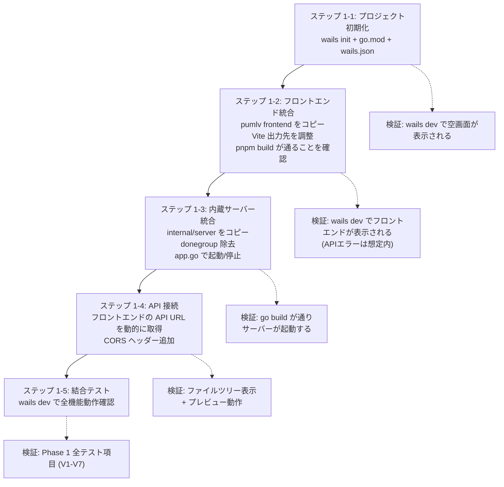
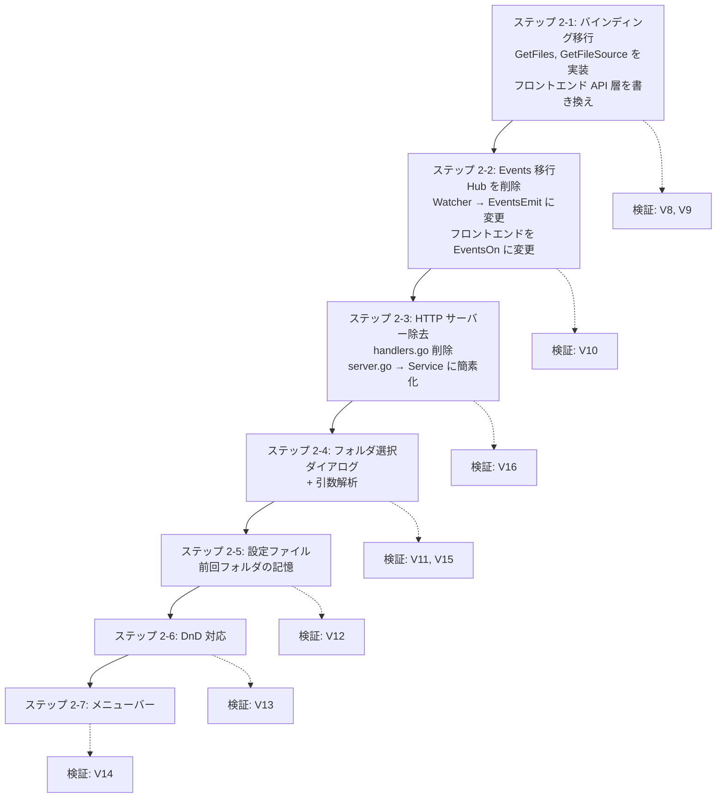

# pumlv-gui 実装計画

> **参照ドキュメント**: [Request.md](file:///d:/work/pumlv-gui/Docs/Request.md) | [Step1_Analysis.md](file:///d:/work/pumlv-gui/Docs/Step1_Analysis.md)

---

## 1. 目的

[pumlv](https://github.com/rin2yh/pumlv)（CLI ベースの PlantUML ローカルプレビューサーバー）を Wails v2 プラットフォームでデスクトップ GUI アプリケーションとして再構築する。

### 達成すべき機能要件

| # | 要件 | 優先度 |
|---|---|---|
| F1 | CLI と同様に、起動時に引数でフォルダを指定する | 必須 |
| F2 | 引数なしで起動したとき OS 標準のダイアログでフォルダを指定する | 必須 |
| F3 | 2回目以降の起動時に、引数なしで起動したときは前回使ったフォルダで開く | 必須 |
| F4 | ドラッグ＆ドロップでフォルダを指定する | 必須 |
| F5 | フォルダを開くメニューから指定する | 必須 |

### 非機能要件

- pumlv の中核機能（ファイル監視、PlantUML レンダリング、ライブリロード）を維持する
- 単一バイナリ配布を維持する
- Windows を主要ターゲット（macOS/Linux もアーキテクチャ上考慮する）

---

## 2. 分析（現状 vs 理想の状態）

### 現状（pumlv v0.3.6）

```
pumlv バイナリ
├── Cobra CLI → os.Args でパスを受け取る
├── net/http サーバー (localhost) → REST API + SSE を提供
├── fsnotify → ファイル変更監視
├── go:embed → React SPA (Vite ビルド) を内蔵
└── ブラウザ → SPA が EventSource で SSE 受信、TeaVM で PlantUML レンダリング
```

### 理想の状態（pumlv-gui）

```
pumlv-gui バイナリ (Wails v2)
├── os.Args / OS ダイアログ / DnD / メニュー → パスを受け取る
├── Wails Go バインディング → フロントエンドと直接通信
├── Wails Events → ファイル変更通知
├── fsnotify → ファイル変更監視 (pumlv と同一ロジック)
├── go:embed (Wails AssetServer) → React SPA を内蔵
├── 設定ファイル → 前回フォルダの記憶
└── WebView2 → SPA が TeaVM で PlantUML レンダリング
```

### 差分のサマリ

| 層 | 現状 | 理想 | 変更量 |
|---|---|---|---|
| エントリポイント | Cobra CLI | `os.Args` 解析 + `wails.Run()` | **大** |
| バックエンド通信 | `net/http` REST + SSE | Wails Go バインディング + Events | **大** |
| フロントエンド API | `fetch()` + `EventSource` | Wails JS バインディング + `EventsOn` | **大** |
| ファイル監視 | `fsnotify` + `Hub` | `fsnotify` + `runtime.EventsEmit` | **小** |
| ファイル管理 | `Registry` | `Registry`（再利用） | **なし** |
| PlantUML レンダリング | TeaVM (ブラウザ内) | TeaVM (WebView 内) — 同一 | **なし** |
| UI コンポーネント | React SPA | React SPA（再利用 + 拡張） | **小〜中** |
| フォルダ指定 | CLI 引数のみ | 引数 / ダイアログ / DnD / メニュー / 前回記憶 | **新規** |

---

## 3. 提案される変更 — 2段階アプローチ

### Phase 1: 最小限の移行（動作するデスクトップアプリ）

> **目標**: pumlv の内部 HTTP サーバーをそのまま内蔵し、Wails の WebView からアクセスする。最小限のコード変更で「デスクトップアプリとして PlantUML プレビューが動く」ことを確認する。

### Phase 2: Wails ネイティブ化 + GUI 機能拡張

> **目標**: HTTP サーバーを Wails バインディング + Events に置き換え、GUI 固有機能（フォルダ選択ダイアログ、DnD、メニュー、設定記憶）を実装する。

---

## 4. Phase 1 — 詳細設計

### 4.1 プロジェクト構造

```
d:\work\pumlv-gui\
├── .agents/                          # エージェント設定（既存）
├── Docs/                             # ドキュメント（既存）
├── PlansWalks/                       # 計画書（このファイル）
├── pumlv/                            # クローン済みの pumlv リポジトリ（参照用）
│
├── main.go                           # [新規] Wails エントリポイント
├── app.go                            # [新規] アプリケーションロジック
├── go.mod                            # [新規] Go モジュール定義
├── go.sum                            # [新規] 依存関係ハッシュ
├── wails.json                        # [新規] Wails 設定
│
├── internal/
│   ├── server/                       # [コピー] pumlv/internal/server から
│   │   ├── files.go                  #   Registry — 変更なし
│   │   ├── hub.go                    #   Hub — 変更なし
│   │   ├── watcher.go                #   Watcher — donegroup 依存を簡素化
│   │   ├── server.go                 #   Server — donegroup 依存を簡素化
│   │   └── handlers.go              #   API ハンドラー — SPA 配信を除去
│   └── static/
│       └── embed.go                  # [コピー] → dist 埋め込み（参照先を調整）
│
├── frontend/                         # [コピー+修正] pumlv/internal/frontend から
│   ├── package.json                  # pnpm + Vite + React 構成
│   ├── pnpm-lock.yaml
│   ├── vite.config.ts                # 出力先を ../internal/static/dist に設定
│   ├── scripts/
│   │   └── fetch-plantuml-core.mjs   # PlantUML ダウンロード
│   └── src/
│       ├── main.tsx
│       ├── app.tsx
│       ├── api/
│       │   ├── files.ts              # [修正] ベースURL を localhost:PORT に変更
│       │   └── events.ts             # [修正] EventSource の URL を変更
│       ├── hooks/                    # 変更なし
│       ├── components/               # 変更なし
│       ├── plantuml/                 # 変更なし
│       └── lib/                      # 変更なし
│
├── version/
│   └── version.go                    # [新規] バージョン情報
│
└── build/                            # Wails ビルド設定（アイコン等）
    ├── appicon.png
    └── windows/
```

### 4.2 作成・変更するファイル一覧

#### 4.2.1 新規作成ファイル

| ファイル | 説明 |
|---|---|
| `main.go` | Wails エントリポイント。`wails.Run()` を呼び出す |
| `app.go` | `App` 構造体。`startup()`, `shutdown()` ライフサイクル管理 |
| `go.mod` | Go モジュール定義。pumlv 依存 + wails/v2 依存 |
| `wails.json` | Wails プロジェクト設定 |
| `version/version.go` | バージョン情報定数 |
| `build/appicon.png` | アプリケーションアイコン |

#### 4.2.2 pumlv からコピーして修正するファイル

| ファイル | 修正内容 |
|---|---|
| `internal/server/server.go` | `donegroup` への依存を除去し、`Start()` / `Shutdown()` を簡素化 |
| `internal/server/handlers.go` | `handleStatic()` を除去（SPA 配信は Wails が担当）。CORS ヘッダー追加 |
| `internal/server/files.go` | 変更なし（そのままコピー） |
| `internal/server/hub.go` | 変更なし（そのままコピー） |
| `internal/server/watcher.go` | `donegroup` への依存を除去 |
| `internal/static/embed.go` | パス調整（`//go:embed all:dist`） |
| `frontend/` 全体 | `pumlv/internal/frontend` からコピー |
| `frontend/src/api/files.ts` | `fetch()` のベース URL を `http://localhost:<PORT>` に変更 |
| `frontend/src/api/events.ts` | `EventSource` の URL を `http://localhost:<PORT>/api/events` に変更 |
| `frontend/vite.config.ts` | `build.outDir` を `../internal/static/dist` に調整。`server.proxy` を更新 |

### 4.3 主要ファイルの設計

#### `main.go`（擬似コード）

```go
package main

import (
    "embed"

    "github.com/wailsapp/wails/v2"
    "github.com/wailsapp/wails/v2/pkg/options"
    "github.com/wailsapp/wails/v2/pkg/options/assetserver"
)

//go:embed all:frontend/dist
var assets embed.FS

func main() {
    app := NewApp()

    err := wails.Run(&options.App{
        Title:  "pumlv",
        Width:  1280,
        Height: 800,
        AssetServer: &assetserver.Options{
            Assets: assets,
        },
        OnStartup:  app.startup,
        OnShutdown: app.shutdown,
        Bind: []interface{}{
            app,
        },
    })
    if err != nil {
        // エラーハンドリング
    }
}
```

#### `app.go`（擬似コード）

```go
package main

import (
    "context"
    "os"

    "pumlv-gui/internal/server"
)

type App struct {
    ctx context.Context
    srv *server.Server
}

func NewApp() *App {
    return &App{}
}

func (a *App) startup(ctx context.Context) {
    a.ctx = ctx

    // CLI 引数からパスを取得
    paths := os.Args[1:]
    if len(paths) == 0 {
        // Phase 1 ではデフォルトパスを使用（Phase 2 でダイアログに変更）
        return
    }

    // 内部 HTTP サーバーを起動（API + SSE のみ、SPA 配信なし）
    opts := server.Options{
        Paths: paths,
        Host:  "127.0.0.1",
        Port:  0, // 空きポートを自動選択
        Exts:  []string{".puml", ".plantuml", ".iuml", ".wsd"},
    }
    srv, err := server.New(ctx, opts)
    if err != nil {
        // エラーハンドリング
        return
    }
    addr, err := srv.Start(ctx)
    if err != nil {
        // エラーハンドリング
        return
    }
    a.srv = srv

    // フロントエンドに API サーバーのアドレスを通知
    // → Phase 1 では Wails バインディングで addr を返すメソッドを用意
}

// GetAPIAddress はフロントエンドが API サーバーの URL を取得するために呼ぶ
func (a *App) GetAPIAddress() string {
    if a.srv == nil {
        return ""
    }
    return a.srv.Address() // ← server.go に Address() メソッドを追加
}

func (a *App) shutdown(ctx context.Context) {
    if a.srv != nil {
        a.srv.Shutdown()
    }
}
```

#### `wails.json`

```json
{
  "$schema": "https://wails.io/schemas/config.v2.json",
  "name": "pumlv-gui",
  "outputfilename": "pumlv-gui",
  "frontend:install": "pnpm install",
  "frontend:build": "pnpm run build",
  "frontend:dev:watcher": "pnpm run dev",
  "frontend:dev:serverUrl": "auto",
  "frontend:dir": "frontend",
  "author": {
    "name": "pumlv-gui"
  }
}
```

#### `frontend/src/api/files.ts`（修正部分）

```typescript
// Phase 1: Wails バインディング経由で API サーバーのベース URL を取得
import { GetAPIAddress } from '../../wailsjs/go/main/App';

let _baseUrl: string | null = null;

async function getBaseUrl(): Promise<string> {
  if (_baseUrl !== null) return _baseUrl;
  _baseUrl = await GetAPIAddress();
  return _baseUrl;
}

export async function fetchFiles(): Promise<FileEntry[]> {
  const base = await getBaseUrl();
  const res = await fetch(`${base}/api/files`);
  // ...
}
```

#### `frontend/src/api/events.ts`（修正部分）

```typescript
import { GetAPIAddress } from '../../wailsjs/go/main/App';

export async function subscribe(onEvent: EventHandler): Promise<() => void> {
  const base = await GetAPIAddress();
  const source = new EventSource(`${base}/api/events`);
  // ... 既存のイベントリスナー登録
  return () => source.close();
}
```

### 4.4 `internal/server/server.go` の修正方針

```go
// donegroup を除去し、標準的な context.Context + goroutine で管理

type Server struct {
    opts     Options
    registry *Registry
    watcher  *Watcher
    hub      *Hub
    httpd    *http.Server
    addr     string  // ← 追加: 解決済みアドレスを保持
}

// Address は起動後のリスニングアドレスを返す
func (s *Server) Address() string {
    return "http://" + s.addr
}

// Start は donegroup を使わず、goroutine で HTTP サーバーを起動
func (s *Server) Start(ctx context.Context) (string, error) {
    // net.Listen → goroutine で httpd.Serve
    // watcher.Start(ctx) で監視開始
}

// Shutdown はグレースフルシャットダウンを行う
func (s *Server) Shutdown() error {
    s.hub.Close()
    ctx, cancel := context.WithTimeout(context.Background(), 3*time.Second)
    defer cancel()
    if err := s.httpd.Shutdown(ctx); err != nil {
        return err
    }
    return s.watcher.Close()
}
```

### 4.5 Phase 1 の検証計画

| # | テスト項目 | 検証方法 | 合格基準 |
|---|---|---|---|
| V1 | `wails dev` でビルドが通る | コマンド実行 | エラーなく起動 |
| V2 | WebView でファイルツリーが表示される | 目視確認 | サイドバーにファイル一覧が表示 |
| V3 | PlantUML レンダリングが動作する | ファイル選択 | SVG プレビューが表示される |
| V4 | ライブリロードが動作する | `.puml` ファイルを編集・保存 | 自動で再レンダリング |
| V5 | SSE 接続が維持される | DevTools Network タブ | EventSource が connected 状態 |
| V6 | CLI 引数でフォルダ指定できる | `pumlv-gui.exe ./examples` | 指定フォルダのファイルが表示 |
| V7 | アプリ終了時にリソースが解放される | アプリを閉じる | プロセスが正常終了、ポートが解放 |

### 4.6 Phase 1 部分検証策

Phase 1 は以下のサブステップに分けて段階的に検証する：



#### ステップ 1-1: プロジェクト初期化

- `wails init -n pumlv-gui -t react-ts` を実行（テンプレート生成）
- 生成されたファイルのうち、必要なもの（`main.go`, `wails.json`, `build/`）だけを残す
- `go.mod` を作成し、Wails v2 依存を追加
- **検証**: `wails dev` でデフォルトの空アプリが起動することを確認

#### ステップ 1-2: フロントエンド統合

- `pumlv/internal/frontend/` → `frontend/` にコピー
- `vite.config.ts` の `build.outDir` を Wails の `embed` パスに調整
- `pnpm install` → `pnpm run build` が通ることを確認
- `fetch-plantuml-core.mjs` が PlantUML ファイルをダウンロードできることを確認
- **検証**: `wails dev` でフロントエンド画面が表示される（API 接続エラーは想定内）

#### ステップ 1-3: 内蔵サーバー統合

- `pumlv/internal/server/` → `internal/server/` にコピー
- `go.mod` に `fsnotify` 等の依存を追加
- `server.go` から `donegroup` への依存を除去
- `handlers.go` から `handleStatic()` を除去（SPA 配信は Wails が担当）
- `handlers.go` に CORS ヘッダーを追加（`Access-Control-Allow-Origin: *` — ローカル限定なので安全）
- `app.go` で `startup()` / `shutdown()` を実装
- `App.GetAPIAddress()` バインディングメソッドを実装
- **検証**: `go build` が通り、アプリ起動時にサーバーがバックグラウンドで動作する

#### ステップ 1-4: API 接続

- `frontend/src/api/files.ts` の `fetch()` URL を動的に取得するように修正
- `frontend/src/api/events.ts` の `EventSource` URL を動的に取得するように修正
- `use-server-events.ts` フックの `subscribe()` 呼び出しを非同期対応に修正
- **検証**: ファイルツリー表示 + PlantUML プレビュー動作

#### ステップ 1-5: 結合テスト

- `wails dev` で全機能テスト
- Phase 1 全テスト項目 (V1-V7) を実施
- `wails build` で本番バイナリをビルドし、動作確認

---

## 5. Phase 2 — 詳細設計

### 5.1 Phase 2A: Wails ネイティブ通信への移行

#### 変更概要

内蔵 HTTP サーバーを完全に除去し、全通信を Wails バインディング + Events に置き換える。

#### 作成・変更するファイル

| ファイル | 変更内容 |
|---|---|
| `app.go` | `GetFiles()`, `GetFileSource(path)`, `OpenFolder(paths)` バインディングメソッドを追加。HTTP サーバーの起動を除去 |
| `internal/server/` | `handlers.go` を除去。`server.go` を HTTP サーバーなしの `Service` に書き換え |
| `internal/watcher/` | `watcher.go` + `hub.go` をリファクタリングし、`runtime.EventsEmit` を直接呼ぶように変更 |
| `frontend/src/api/files.ts` | `fetch()` → Wails JS バインディング (`GetFiles()`, `GetFileSource()`) に置き換え |
| `frontend/src/api/events.ts` | `EventSource` → `EventsOn()` / `EventsOff()` に置き換え |
| `frontend/src/hooks/use-server-events.ts` | SSE フック → Wails Events フックに書き換え |

#### `app.go` バインディングメソッド（擬似コード）

```go
// GetFiles はフロントエンドに公開。監視中のファイル一覧を返す。
func (a *App) GetFiles() []server.FileEntry {
    return a.registry.List()
}

// GetFileSource はフロントエンドに公開。指定パスのファイル内容を返す。
func (a *App) GetFileSource(path string) (string, error) {
    abs, err := filepath.Abs(path)
    if err != nil {
        return "", err
    }
    if !a.registry.Allowed(abs) {
        return "", fmt.Errorf("file not allowed: %s", path)
    }
    data, err := os.ReadFile(abs)
    if err != nil {
        return "", err
    }
    return string(data), nil
}
```

#### Watcher のイベント発行（擬似コード）

```go
// watcher 内で、Hub への broadcast の代わりに runtime.EventsEmit を呼ぶ
func (w *Watcher) handleEvent(event fsnotify.Event) {
    // ファイルツリー変更
    if event.Op&(fsnotify.Create|fsnotify.Remove|fsnotify.Rename) != 0 {
        w.registry.Refresh()
        runtime.EventsEmit(w.ctx, "tree:changed", nil)
    }
    // ファイル内容変更
    if w.registry.matchExt(event.Name) {
        w.debounce(event.Name)
        // debounce 後: runtime.EventsEmit(w.ctx, "file:changed", path)
    }
}
```

#### フロントエンド側（擬似コード）

```typescript
// frontend/src/api/files.ts
import { GetFiles, GetFileSource } from '../../wailsjs/go/main/App';
// fetch() の代わりに直接 Go メソッドを呼ぶ

// frontend/src/api/events.ts
import { EventsOn, EventsOff } from '../../wailsjs/runtime/runtime';

export function subscribe(onEvent: EventHandler): () => void {
  const cancelChanged = EventsOn("file:changed", (path: string) => {
    onEvent({ type: "changed", path });
  });
  const cancelTree = EventsOn("tree:changed", () => {
    onEvent({ type: "tree" });
  });
  return () => {
    cancelChanged();
    cancelTree();
  };
}
```

### 5.2 Phase 2B: GUI 機能拡張

#### 5.2.1 OS 標準ダイアログによるフォルダ選択（F2）

```go
func (a *App) SelectFolder() (string, error) {
    selection, err := runtime.OpenDirectoryDialog(a.ctx, runtime.OpenDialogOptions{
        Title:            "フォルダを選択",
        DefaultDirectory: a.lastFolder, // 前回のフォルダ
    })
    if err != nil {
        return "", err
    }
    if selection == "" {
        return "", nil // キャンセル
    }
    return selection, nil
}
```

#### 5.2.2 起動引数によるフォルダ指定（F1）

```go
func main() {
    app := NewApp()

    // os.Args からフォルダパスを抽出
    paths := parseArgs(os.Args[1:])
    app.initialPaths = paths

    wails.Run(&options.App{
        // ...
        OnStartup: app.startup,
    })
}
```

#### 5.2.3 前回フォルダの記憶（F3）

```go
// 設定ファイル: ~/.pumlv-gui/config.json
type Config struct {
    LastFolder    string   `json:"lastFolder"`
    RecentFolders []string `json:"recentFolders,omitempty"`
}

func (a *App) startup(ctx context.Context) {
    a.ctx = ctx

    // 設定を読み込む
    a.config = loadConfig()

    paths := a.initialPaths
    if len(paths) == 0 && a.config.LastFolder != "" {
        paths = []string{a.config.LastFolder}
    }

    if len(paths) == 0 {
        // ダイアログで選択
        // ...
    }
}

func (a *App) shutdown(ctx context.Context) {
    // 設定を保存
    saveConfig(a.config)
}
```

#### 5.2.4 ドラッグ＆ドロップ対応（F4）

```go
// main.go
wails.Run(&options.App{
    // ...
    DragAndDrop: &options.DragAndDrop{
        EnableFileDrop:     true,
        DisableWebViewDrop: true,
    },
    OnStartup: func(ctx context.Context) {
        app.startup(ctx)
        runtime.OnFileDrop(ctx, func(x, y int, paths []string) {
            // パスがディレクトリかチェック
            for _, p := range paths {
                if info, err := os.Stat(p); err == nil && info.IsDir() {
                    app.OpenFolder(p)
                    return
                }
            }
        })
    },
})
```

#### 5.2.5 メニューバー実装（F5）

```go
AppMenu := menu.NewMenu()
FileMenu := AppMenu.AddSubmenu("ファイル")
FileMenu.AddText("フォルダを開く...", keys.CmdOrCtrl("o"), func(_ *menu.CallbackData) {
    folder, err := app.SelectFolder()
    if err == nil && folder != "" {
        app.OpenFolder(folder)
    }
})
FileMenu.AddSeparator()
FileMenu.AddText("終了", keys.CmdOrCtrl("q"), func(_ *menu.CallbackData) {
    runtime.Quit(app.ctx)
})

wails.Run(&options.App{
    // ...
    Menu: AppMenu,
})
```

### 5.3 Phase 2 の作成・変更するファイル一覧

| ファイル | 変更内容 |
|---|---|
| `main.go` | メニュー追加、DnD 設定追加 |
| `app.go` | `GetFiles()`, `GetFileSource()`, `SelectFolder()`, `OpenFolder()` 追加。設定管理追加 |
| `internal/server/server.go` | HTTP サーバーを除去、`Service` 構造体に簡素化 |
| `internal/server/handlers.go` | ファイル削除（不要） |
| `internal/server/watcher.go` | `runtime.EventsEmit` を直接呼ぶように変更 |
| `internal/server/hub.go` | ファイル削除（不要。Events が代替） |
| `internal/config/config.go` | [新規] 設定ファイルの読み書き |
| `frontend/src/api/files.ts` | Wails JS バインディングに置き換え |
| `frontend/src/api/events.ts` | Wails Events に置き換え |
| `frontend/src/hooks/use-server-events.ts` | Wails Events フックに書き換え |
| `frontend/src/app.tsx` | フォルダ未選択時の UI（ウェルカム画面）追加 |

### 5.4 Phase 2 の検証計画

| # | テスト項目 | 検証方法 | 合格基準 |
|---|---|---|---|
| V8 | Wails バインディングでファイル一覧を取得できる | DevTools Console で `window.go.main.App.GetFiles()` | JSON 配列が返る |
| V9 | Wails バインディングでファイル内容を取得できる | 同上 `GetFileSource(path)` | テキストが返る |
| V10 | Wails Events でファイル変更が通知される | `.puml` を編集 | UI が自動更新 |
| V11 | OS ダイアログでフォルダ選択できる | 引数なしで起動 | OS ネイティブダイアログが表示 |
| V12 | 前回のフォルダが記憶される | アプリ再起動 | 前回のフォルダで開く |
| V13 | DnD でフォルダ指定できる | フォルダをウィンドウにドロップ | フォルダ内のファイルが表示 |
| V14 | メニューからフォルダ選択できる | メニュー → フォルダを開く | ダイアログが表示 |
| V15 | 引数でフォルダ指定できる | `pumlv-gui.exe ./examples` | 指定フォルダのファイルが表示 |
| V16 | 内蔵 HTTP サーバーが完全に除去されている | `netstat` で確認 | TCP リスニングなし |

### 5.5 Phase 2 部分検証策



---

## 6. リスク評価

### 6.1 ハルシネーション回避策

| リスク | 回避策 |
|---|---|
| Wails API の使い方が実際と異なる | 各ステップで `wails doctor` + `wails dev` で即時検証 |
| `go:embed` パスのミスマッチ | ビルド前に `dist/` ディレクトリの存在を確認するスクリプトを用意 |
| CORS 問題（Phase 1 固有） | 内蔵サーバーに `Access-Control-Allow-Origin: *` を設定（localhost 限定で安全） |
| `plantuml.js` がロードされない | DevTools の Network/Console で確認。パスの問題はステップ 1-2 で早期検出 |

### 6.2 潜在的な副作用

| 副作用 | 対策 |
|---|---|
| Windows の `go:generate sh -c` が動かない | Wails のビルドチェーン (`wails.json` の `frontend:build`) に委譲するため不要 |
| `go 1.26.2` と Wails v2 の互換性 | ステップ 1-1 で即座に検証。問題があれば Go バージョンを調整 |
| pnpm が Wails の想定する npm と異なる | `wails.json` の `frontend:install` / `frontend:build` でカスタム指定 |
| Phase 1 の内蔵 HTTP サーバーがファイアウォールに引っかかる | `127.0.0.1` のみにバインド。Phase 2 で完全除去 |
| TeaVM の大きなファイル (~8.4MB) がバイナリサイズを増加 | pumlv 本来の設計と同じ。受容する |

---

## 7. AGENTS.md 方針

Phase 1 完了後、以下を含む `AGENTS.md` を作成する：

- プロジェクト概要（pumlv-gui の目的）
- ビルドコマンド（`wails dev`, `wails build`）
- ディレクトリ構造の説明
- pumlv オリジナルとの差分の説明
- コーディング規約（Go / TypeScript）

---

## 8. スケジュール概算

| Phase | ステップ | 見積もり |
|---|---|---|
| **Phase 1** | 1-1 プロジェクト初期化 | 小 |
| | 1-2 フロントエンド統合 | 小〜中 |
| | 1-3 内蔵サーバー統合 | 中 |
| | 1-4 API 接続 | 中 |
| | 1-5 結合テスト | 小 |
| **Phase 2** | 2-1 バインディング移行 | 中 |
| | 2-2 Events 移行 | 中 |
| | 2-3 HTTP サーバー除去 | 小 |
| | 2-4 ダイアログ + 引数 | 小 |
| | 2-5 設定ファイル | 小 |
| | 2-6 DnD 対応 | 小 |
| | 2-7 メニューバー | 小 |

---

> **注意**: この計画は実装前の設計段階です。実装に進むには、この計画を確認し、新しいリクエストを送信してください。
